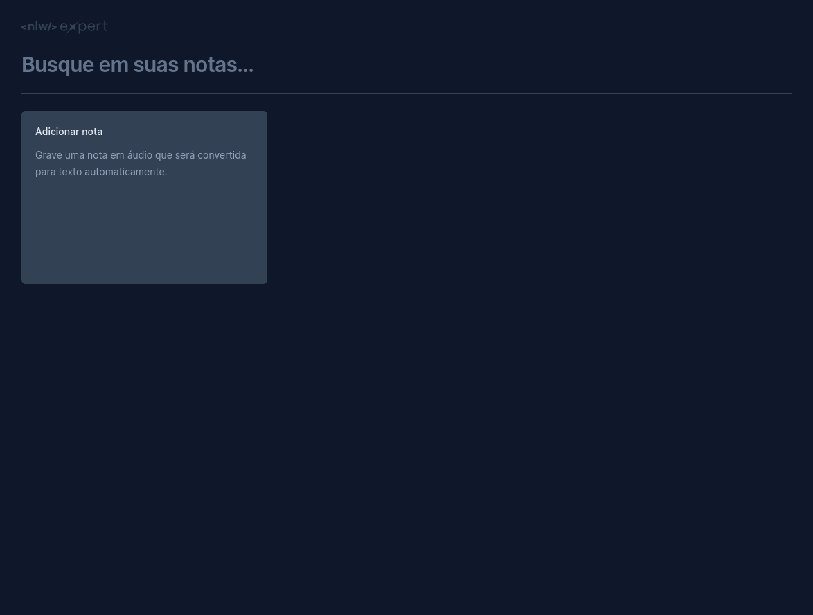
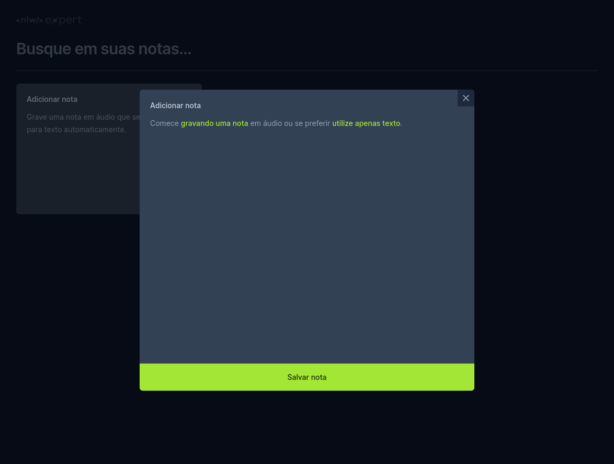
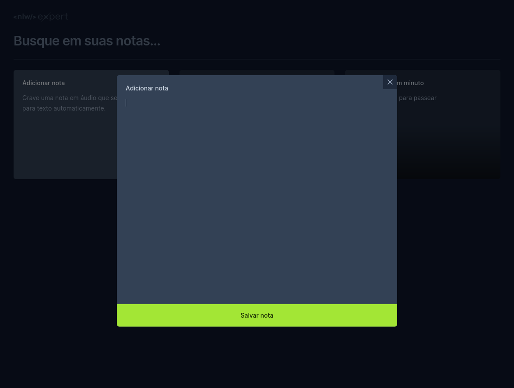
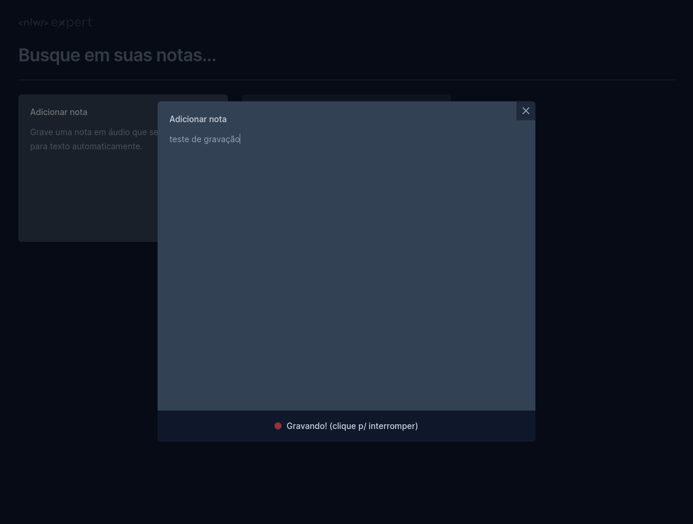
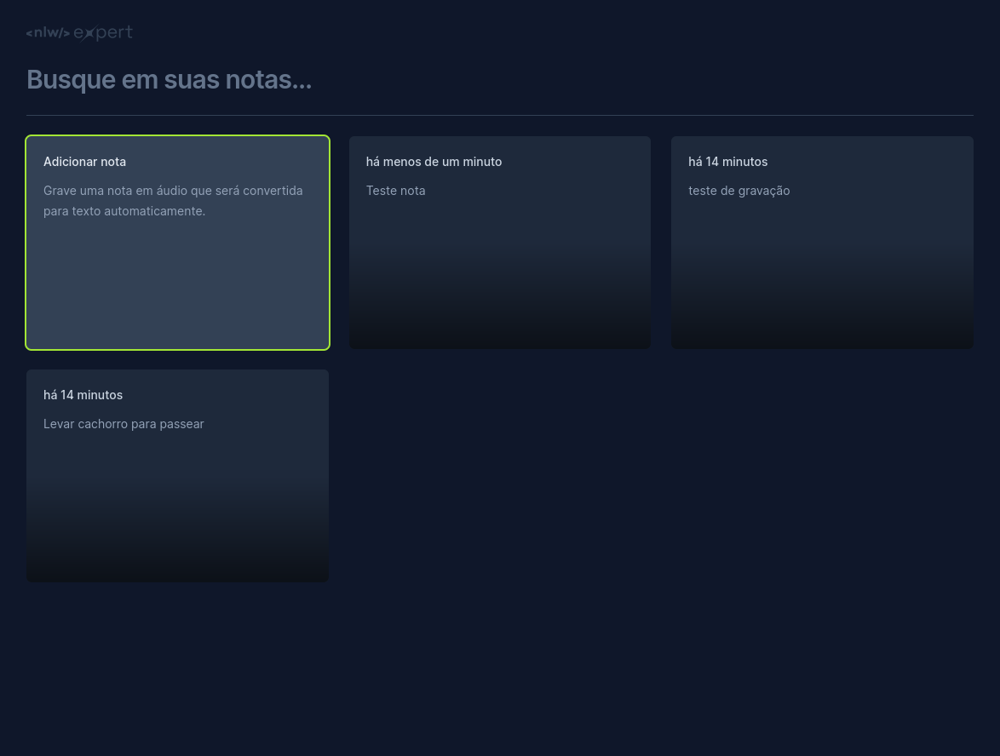
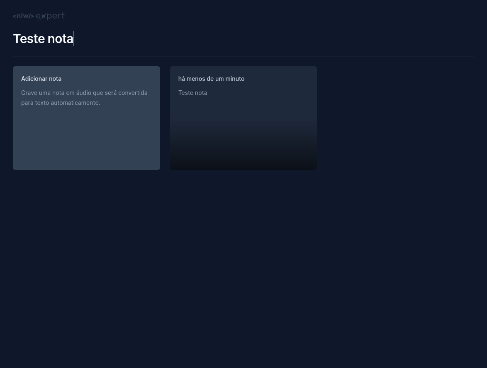

# 

  Projeto feito com React. Ao clicar em "Adicionar nota", uma modal é aberta e é possível escolher se quer gravar uma nota em áudio que será convertida em texto, ou digitá-la diretamente. Após isso ela ficará salva mesmo após o recarregamento da página, e você pode filtrar os resultados para encontrar uma nota específica.

    
    
    
    
    
    

  Feito com ♡ por Helen Andrade

